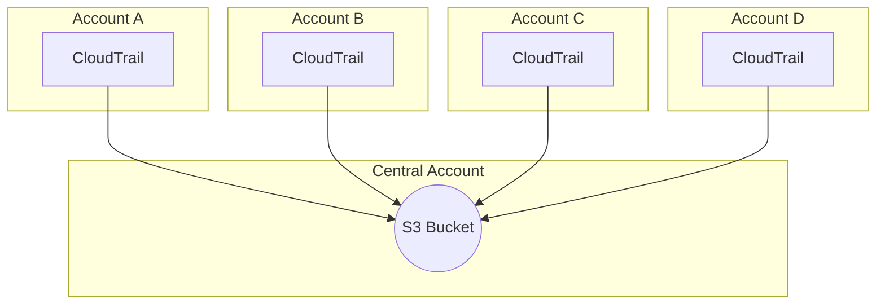

# terraform-aws-cloudtrail-bucket

[](https://github.com/rhythmictech/terraform-aws-cloudtrail-bucket/actions?query=workflow%3Atflint+event%3Apush+branch%3Amaster)
[](https://github.com/rhythmictech/terraform-aws-cloudtrail-bucket/actions?query=workflow%3Atfsec+event%3Apush+branch%3Amaster)
[](https://github.com/rhythmictech/terraform-aws-cloudtrail-bucket/actions?query=workflow%3Ayamllint+event%3Apush+branch%3Amaster)
[](https://github.com/rhythmictech/terraform-aws-cloudtrail-bucket/actions?query=workflow%3Amisspell+event%3Apush+branch%3Amaster)
[](https://github.com/rhythmictech/terraform-aws-cloudtrail-bucket/actions?query=workflow%3Apre-commit-check+event%3Apush+branch%3Amaster)


Create and manage a bucket suitable for encrypted CloudTrail logging. Supports inbound logging from multiple accounts through the `allowed_account_ids` var.

## Usage
To create a bucket in this account that can be logged to from acct 12345678 and the current account
```
module "s3logging-bucket" {
  source = "rhythmictech/s3logging-bucket/aws"
  version = "v4.0.1"
}

# in acct 23456789
module "cloudtrail-bucket" {
  source         = "git::https://github.com/rhythmictech/terraform-aws-cloudtrail-bucket"

  allowed_account_ids = [12345678, 123456781, 123456782, 123456783]
  logging_bucket      = module.s3logging-bucket.s3logging_bucket_name
  region              = var.region
}

module "cloudtrail-logging" {
  source            = "git::https://github.com/rhythmictech/terraform-aws-cloudtrail-logging"
  cloudtrail_bucket = module.cloudtrail-bucket.s3_bucket_name
  kms_key_id        = module.cloudtrail-bucket.kms_key_id
  region            = var.region
}
```

Then in acct 12345678 and the other child accounts you can log back to the bucket like this 
```
# in acct 12345678
module "cloudtrail-logging" {
  source            = "git::https://github.com/rhythmictech/terraform-aws-cloudtrail-logging"
  cloudtrail_bucket = "23456789-us-east-1-cloudtrail"
  kms_key_id        = "arn:aws:kms:us-east-1:23456789:key/a53f476a-e691-4d19-9003-202e6fb9c5b4"
  region            = var.region
}
```

In this diagram Central Account is `12345678` from the example and Account A is `12345678`. Accounts B, C, and D would be other child accounts (`123456781, 123456782, 123456783`)


<!-- BEGINNING OF PRE-COMMIT-TERRAFORM DOCS HOOK -->
## Requirements

| Name | Version |
|------|---------|
| <a name="requirement_terraform"></a> [terraform](#requirement\_terraform) | >= 1.3 |
| <a name="requirement_aws"></a> [aws](#requirement\_aws) | >= 5 |

## Providers

| Name | Version |
|------|---------|
| <a name="provider_aws"></a> [aws](#provider\_aws) | 4.48.0 |

## Modules

No modules.

## Resources

| Name | Type |
|------|------|
| [aws_kms_alias.this](https://registry.terraform.io/providers/hashicorp/aws/latest/docs/resources/kms_alias) | resource |
| [aws_kms_key.this](https://registry.terraform.io/providers/hashicorp/aws/latest/docs/resources/kms_key) | resource |
| [aws_s3_bucket.this](https://registry.terraform.io/providers/hashicorp/aws/latest/docs/resources/s3_bucket) | resource |
| [aws_s3_bucket_lifecycle_configuration.this](https://registry.terraform.io/providers/hashicorp/aws/latest/docs/resources/s3_bucket_lifecycle_configuration) | resource |
| [aws_s3_bucket_logging.this](https://registry.terraform.io/providers/hashicorp/aws/latest/docs/resources/s3_bucket_logging) | resource |
| [aws_s3_bucket_policy.this](https://registry.terraform.io/providers/hashicorp/aws/latest/docs/resources/s3_bucket_policy) | resource |
| [aws_s3_bucket_public_access_block.this](https://registry.terraform.io/providers/hashicorp/aws/latest/docs/resources/s3_bucket_public_access_block) | resource |
| [aws_s3_bucket_server_side_encryption_configuration.this](https://registry.terraform.io/providers/hashicorp/aws/latest/docs/resources/s3_bucket_server_side_encryption_configuration) | resource |
| [aws_s3_bucket_versioning.this](https://registry.terraform.io/providers/hashicorp/aws/latest/docs/resources/s3_bucket_versioning) | resource |
| [aws_caller_identity.current](https://registry.terraform.io/providers/hashicorp/aws/latest/docs/data-sources/caller_identity) | data source |
| [aws_iam_policy_document.key](https://registry.terraform.io/providers/hashicorp/aws/latest/docs/data-sources/iam_policy_document) | data source |
| [aws_iam_policy_document.key_empty](https://registry.terraform.io/providers/hashicorp/aws/latest/docs/data-sources/iam_policy_document) | data source |
| [aws_iam_policy_document.key_merged_policy](https://registry.terraform.io/providers/hashicorp/aws/latest/docs/data-sources/iam_policy_document) | data source |
| [aws_iam_policy_document.key_roles](https://registry.terraform.io/providers/hashicorp/aws/latest/docs/data-sources/iam_policy_document) | data source |
| [aws_iam_policy_document.this](https://registry.terraform.io/providers/hashicorp/aws/latest/docs/data-sources/iam_policy_document) | data source |
| [aws_partition.current](https://registry.terraform.io/providers/hashicorp/aws/latest/docs/data-sources/partition) | data source |

## Inputs

| Name | Description | Type | Default | Required |
|------|-------------|------|---------|:--------:|
| <a name="input_allowed_account_ids"></a> [allowed\_account\_ids](#input\_allowed\_account\_ids) | Optional list of AWS Account IDs that are permitted to write to the bucket | `list(string)` | `[]` | no |
| <a name="input_bucket_name"></a> [bucket\_name](#input\_bucket\_name) | Name of the S3 bucket to create. Defaults to {account\_id}-{region}-cloudtrail. | `string` | `null` | no |
| <a name="input_lifecycle_rules"></a> [lifecycle\_rules](#input\_lifecycle\_rules) | lifecycle rules to apply to the bucket | <pre>list(object(<br>    {<br>      id                            = string<br>      enabled                       = optional(bool, true)<br>      expiration                    = optional(number)<br>      prefix                        = optional(number)<br>      noncurrent_version_expiration = optional(number)<br>      transition = optional(list(object({<br>        days          = number<br>        storage_class = string<br>      })))<br>  }))</pre> | <pre>[<br>  {<br>    "id": "expire-noncurrent-objects-after-ninety-days",<br>    "noncurrent_version_expiration": 90<br>  },<br>  {<br>    "id": "transition-to-IA-after-30-days",<br>    "transition": [<br>      {<br>        "days": 30,<br>        "storage_class": "STANDARD_IA"<br>      }<br>    ]<br>  },<br>  {<br>    "expiration": 2557,<br>    "id": "delete-after-seven-years"<br>  }<br>]</pre> | no |
| <a name="input_logging_bucket"></a> [logging\_bucket](#input\_logging\_bucket) | S3 bucket with suitable access for logging requests to the cloudtrail bucket | `string` | n/a | yes |
| <a name="input_region"></a> [region](#input\_region) | Region to create KMS key in | `string` | n/a | yes |
| <a name="input_roles_allowed_kms_decrypt"></a> [roles\_allowed\_kms\_decrypt](#input\_roles\_allowed\_kms\_decrypt) | Optional list of roles that have access to KMS decrypt and are permitted to decrypt logs | `list(string)` | `[]` | no |
| <a name="input_tags"></a> [tags](#input\_tags) | Mapping of any extra tags you want added to resources | `map(string)` | `{}` | no |
| <a name="input_versioning_enabled"></a> [versioning\_enabled](#input\_versioning\_enabled) | Whether or not to use versioning on the bucket. This can be useful for audit purposes since objects in a logging bucket should not be updated. | `bool` | `true` | no |

## Outputs

| Name | Description |
|------|-------------|
| <a name="output_kms_key_id"></a> [kms\_key\_id](#output\_kms\_key\_id) | KMS key used by cloudtrail |
| <a name="output_s3_bucket_arn"></a> [s3\_bucket\_arn](#output\_s3\_bucket\_arn) | The ARN of the bucket |
| <a name="output_s3_bucket_name"></a> [s3\_bucket\_name](#output\_s3\_bucket\_name) | The name of the bucket |
<!-- END OF PRE-COMMIT-TERRAFORM DOCS HOOK -->

## Related Projects
* [CloudTrail Logging module](https://github.com/rhythmictech/terraform-aws-cloudtrail-logging)
* [S3 Logging Module](https://github.com/rhythmictech/terraform-aws-s3logging-bucket)
